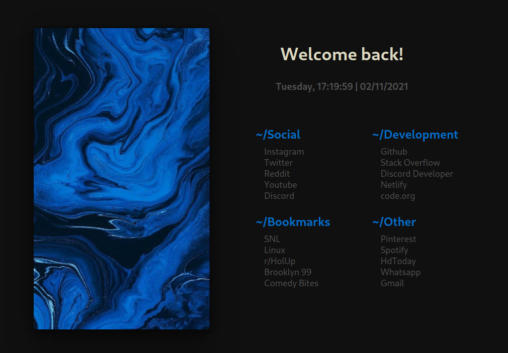
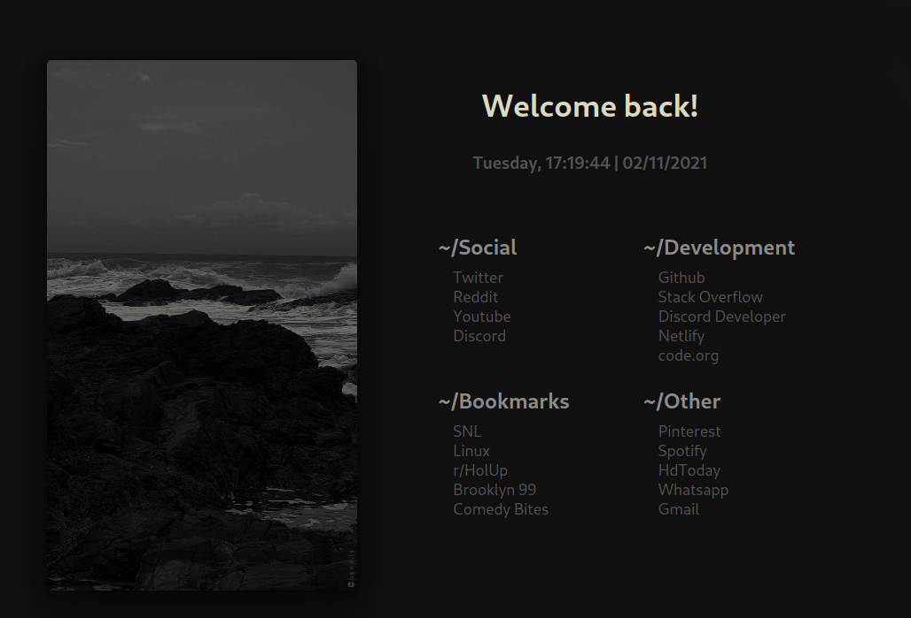
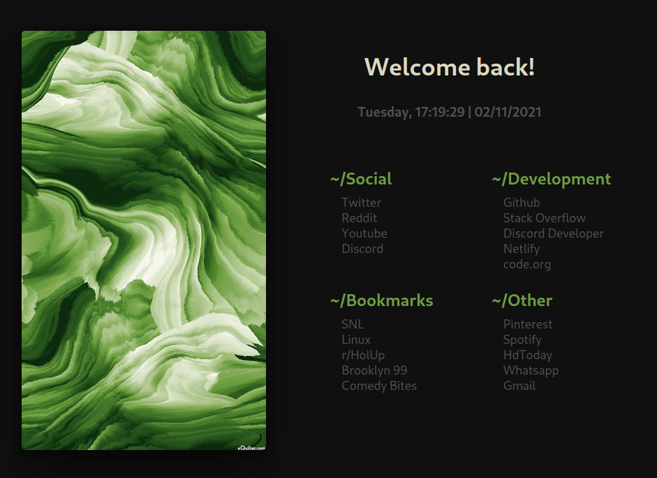
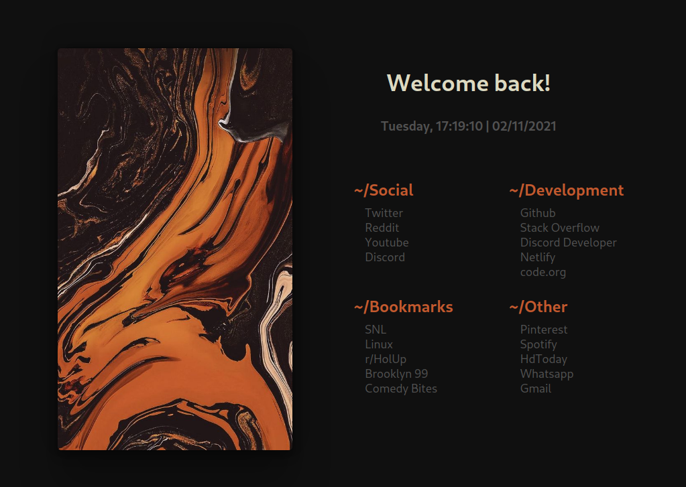
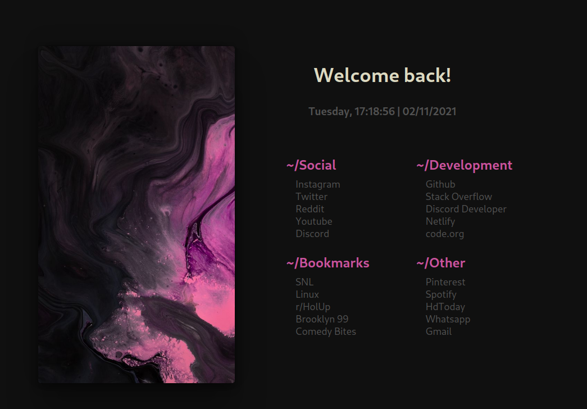
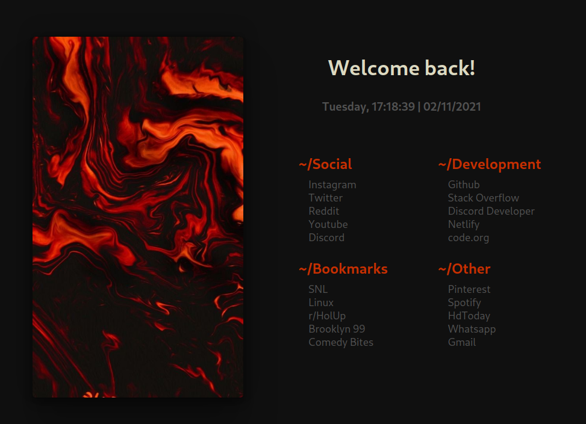
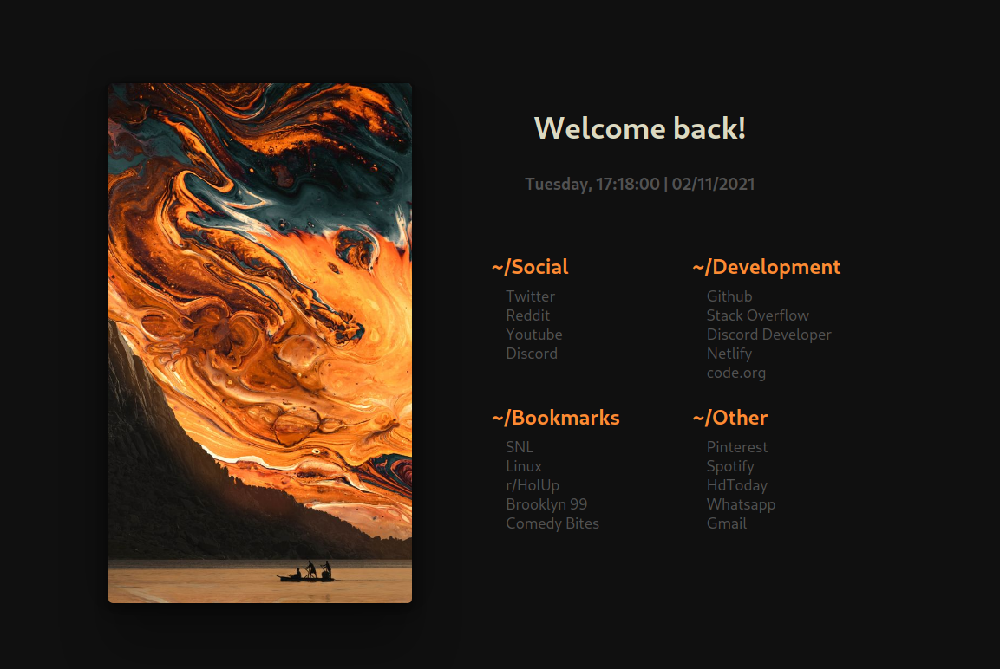

  

  <b>Crappage</b>

<a href="#about">About  |</a>
<a href="#previews">Preview  |</a>
<a href="#setup">Setup  </a>

## About

These Startpages are my configurations of [these startpages](https://github.com/HeavyRain266/Startpage) with different flavours/colors and more.

## Previews

Blue - 

Gray - 

Green - 

Orange - 

Purple - 

Red - 

Yellow - 

